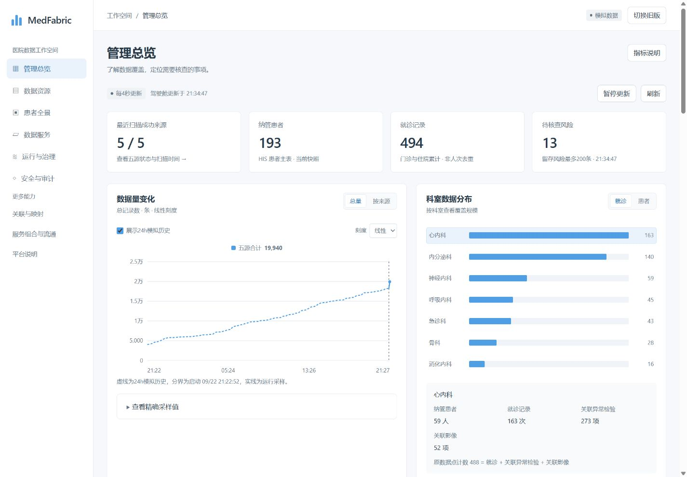

# 数据驾驶舱 V1 开发与检查记录

目标：用 Metabase 风格建立可复用的新系统样式，完成接入现有接口的数据驾驶舱。保留旧页面作为对照，保留 O01–O06 要求的全部展示要素与交互去向。

## 分阶段检查

| 阶段 | 交付物 | 检查标准 | 当前状态 |
|---|---|---|---|
| 1 基线与范围 | 原指标、图表、列表和入口映射 | 八类旧指标、六段执行链、科室详情、五源趋势、诊断Top8、事件和任务均有新位置 | 已核对 |
| 2 共享样式 | workspace.css 与设计规范 | 全局变量、布局和组件可复用；1024/1440桌面与360窄屏可读 | 已实现并检查 |
| 3 页面与数据 | workspace.html / cockpit-model.js / cockpit.js | 接现有接口；新旧切换；原数据范围保留；无伪造完成状态 | 已实现 |
| 4 验收与交付 | 数据模型验证、浏览器检查、对照记录 | 数值口径、交互、错误/空状态、刷新上下文、旧模块入口可核对 | 下列已列场景通过；待用户视觉评审 |

## 版面与数据来源

- 首屏四项：最近扫描成功来源、HIS纳管患者、HIS就诊记录、当前留存待核查风险。
- 主要分析：数据量趋势（总量/五源、线性/对数、可关闭模拟历史）；科室条形图（患者/就诊）及全部原详情。
- 资源与业务：五源规模、最近扫描状态与时间；诊断Top8；完整诊断/查询入口。
- 自动化运行：原六段执行链；总记录、事件窗口、样本图谱、服务调用等其余指标；最近任务和事件类型分布。
- 最新事件：独立SSE、按seq去重、最多80条、可筛类型、可查看原始说明。
- /api/cockpit 提供原驾驶舱指标、科室、历史、任务与分布；/api/overview 补来源扫描状态；/api/security/overview.metrics.open_risks 提供风险队列计数；/api/orchestrator 补终态任务成功率；/api/events 与 /api/stream 提供事件。

## 本轮边界

- 其他八个旧模块保持现有功能入口，本轮仅驾驶舱采用新版页面。
- 不修改业务计算、权限策略、模拟生成器与数据库；已有权限、持久化和完整历史问题不因换样式被宣称解决。
- 数据源“最近扫描成功”不等于持续在线；风险是留存窗口，不是医院全部风险；图谱为最多100位患者的样本。
- 来源/风险等接口非原子快照，分别标成功时间；对照数值验证使用固定响应，不能要求两个实时页面在不同时刻完全相等。
- 24h补充历史保留为演示能力并明确虚线与模拟标识；真实运行采样可单独查看。

## 回退

新版入口 /static/workspace.html，旧版入口 /#cockpit。旧页面只加入新版链接，不删除或替换原页面。暂不自动更改用户默认入口。回退时使用“切换旧版”；后续可移除新增入口与静态文件，原业务不受影响。

## 验证结果

2026-09-22，在独立副本生成模拟数据运行，未启动原仓库的数据生成器。

| 检查 | 结果 |
|---|---|
| 数据语义测试 | 新增16项通过：缺值、零值、终态成功率、按名称选科室、事件去重与80条限制、五源缺值传播、模拟历史确定性与边界、时间转换、未知状态 |
| 原有图谱与趋势测试 | 原有10项通过；合计26项测试通过 |
| 固定快照对应 | 患者193、就诊494、总记录19,940、窗口事件256、图谱614节点/514边、已完成任务40、旧服务调用14、风险13；新页面与固定响应一致 |
| 五源对应 | HIS 2,755、LIS 3,170、PACS 184、EMR 137、IoT 13,694；保留来源规模与扫描详情 |
| 科室及刷新 | 选中呼吸内科后手动刷新仍为该科；进入旧图谱再返回保持选科 |
| 趋势 | 总量/五源切换、对数刻度、精确采样值均可操作；模拟与运行区分；无采样清空旧图例/下拉/详情 |
| 事件 | 类型筛选真实生效；显示匹配数、页内留存数；详情可读原始字段 |
| 新旧与模块入口 | 新→旧驾驶舱、旧→新、关联图谱跳转，以及诊断Top8跳旧诊断检索并带入查询词已验证 |
| 异常与恢复 | 固定服务返回503：保留旧值并提示过期；首次失败为“—”及重试说明；恢复后提示消失 |
| 空态 | 零患者显示0、空任务列表不伪造排队任务、无终态成功率为“—”、空来源与历史不残留旧结果 |
| 布局 | 1440、1280、1024、768、360宽度检查；360宽度页面内容宽345、滚动宽345，宽表仅内部横向滚动 |

独立审查发现的事件错误提示恢复、空趋势残留、首次来源失败和固定图表提示更新问题已修正。上述测试不等同于完整生产安全、临床准确性或负载验收；原有权限与历史持久化缺口仍按产品对应表单独跟踪。

## 要素落点

| 对应表 | 新版位置 |
|---|---|
| O01 原8类指标 | 四个主指标 + 自动执行完成/终态成功率 + 四个资源与运行指标；风险为增加项 |
| O02 科室构成 | 科室条形图、患者/就诊切换、四项详细计数与原数据点组成 |
| O03 诊断/事件分布 | 诊断Top8、全部后端事件类别；点击进入检索/筛选 |
| O04 五源趋势 | 数据量变化，总量/按来源、线性/对数、模拟历史开关、悬停/点击及精确值 |
| O05 六段执行链 | 自动化运行六个阶段，分别链接到相关现有模块 |
| O06 来源/任务/事件/更新 | 来源列表和详情、最近6任务、最近80事件、4秒轮询与SSE、暂停/手动刷新、局部失败说明 |

## 页面预览

运行项目后，从旧页面顶部“新版驾驶舱”进入，或访问 `/static/workspace.html`。新版页面右上角可切回旧版。公共样式说明见 [设计系统](design-system.md)。
